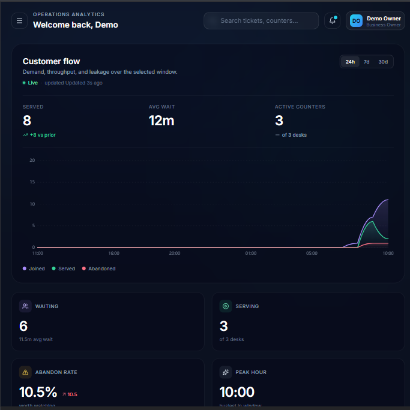
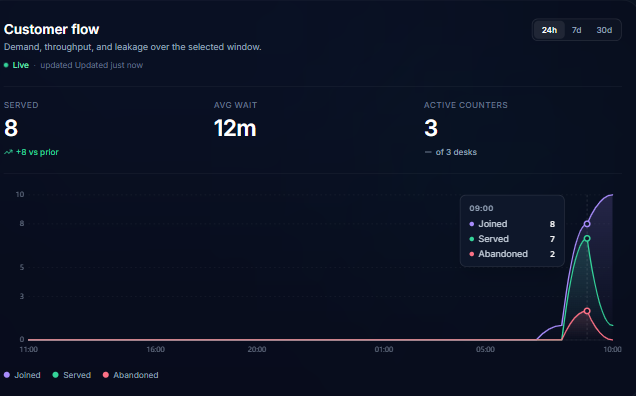
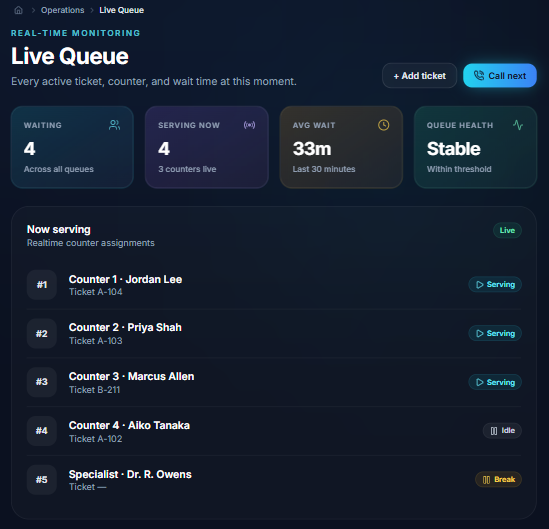
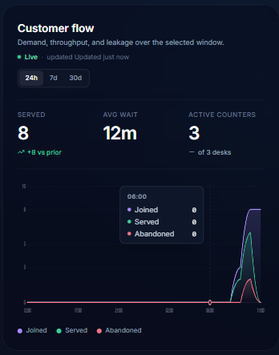

<div align="center">

# FlowOps

### A queue management platform for service businesses.

*From the moment a customer joins a queue to the second they're served — captured, measured, and made actionable.*

<br />

[](https://flowops-io.netlify.app)
[](https://flowops-backend-ua7x.onrender.com/health)

<br />

[](https://react.dev)
[](https://vitejs.dev)
[](https://tailwindcss.com)
[](https://www.framer.com/motion/)
[](https://nodejs.org)
[](https://expressjs.com)
[](https://www.mongodb.com/atlas)
[](https://vitest.dev)
[](https://render.com)
[](https://www.netlify.com)
[](#license)

</div>

---

<!-- HERO SCREENSHOT — replace docs/screenshots/hero.png with a 1600×900 capture -->
<p align="center">
  
</p>

---

## Try it in 30 seconds

> **Note:** the backend runs on Render's free tier and sleeps after 15 min idle.
> First request takes ~30–50 seconds to wake — subsequent requests are instant.

**1. Open the live app:** **[flowops-io.netlify.app](https://flowops-io.netlify.app)**

**2. Sign in to the demo workspace** *(sample data, refreshed on a schedule)*:

| Role | Email | Password |
|---|---|---|
| 👑 Business Owner | `demo.owner@flowops.app` | `Demo123!` |
| 🧑‍💼 Staff | `demo.staff@flowops.app` | `Demo123!` |

**3. Or create your own workspace** — click **Sign up**, enter a company name, and you're a fresh business owner with an empty org. Invite teammates from **Settings → Team**.

---

## What is FlowOps?

FlowOps replaces clipboards, paper tickets, and gut-feel scheduling with a single real-time operations layer. Customers join a digital queue, staff see live workload across desks, and owners get a live picture of throughput, wait time, and customer drop-off — all on one screen.

Built for **clinics, banks, salons, restaurants, government offices, and retail counters** — anywhere a queue forms.

---

## The problem

Modern service businesses lose customers to invisible bottlenecks.

- ⏳ **Endless wait times** frustrate customers and erode loyalty
- 🕶️ **Zero queue visibility** for both staff and customers
- 🧩 **Disconnected operations** create chaos at peak hours
- 📉 **No real-time insight** into what's actually happening on the floor

The cost isn't just inefficiency — it's churn, reputation, and revenue.

---

## Highlights

What's genuinely interesting under the hood:

- **Live updates via SSE, not polling** — owner dashboards, staff consoles, and customer feeds all subscribe to a single org-scoped event stream and re-render within tens of milliseconds of a server-side change (`backend/src/services/sseBroker.js`)
- **Optimistic UI with rollback** — queue and ticket mutations update the local state immediately, with `inflightRef` guarding against polling overwrites (`frontend/src/features/queue/hooks/useQueues.js`)
- **Strict multi-tenancy** — every org-scoped query is filtered by `organizationId` at the middleware layer; cross-org reads are structurally impossible
- **Refresh-token rotation in HTTP-only cookies** — short-lived access tokens (15 min) + 30-day refresh tokens that rotate on every use; auto-refresh on 401 is centralised in `frontend/src/services/api.js`
- **Provider-agnostic mailer** — Resend → SMTP → console fallback, all behind one `sendMail()` function. Mail outage never blocks the business action (`backend/src/services/mailer.js`)
- **Defence-in-depth env validation** — `prestart` runs `check-env.js` which compares `.env.example` against `process.env` and fails the container before traffic hits
- **Anti-enumeration on auth** — `/forgot-password` always returns 200; never leaks whether an email is registered
- **Rate-limited public endpoints** — login, signup, and forgot-password each have their own bucket; brute-force is structurally bounded (`backend/src/routes/authRoutes.js`)
- **35 integration tests** running in CI against `mongodb-memory-server` — auth, queues, tickets, and activity side-effects (`backend/test/`)
- **Single Dockerfile + Render Blueprint** — `render.yaml` + `netlify.toml` mean the entire stack stands up from a fresh clone with two env vars

---

## Screenshots

> Replace the placeholders in `docs/screenshots/` with your own captures (1600×900 PNG works best).

<p align="center">
  <strong>Owner dashboard — live KPIs, customer flow, and AI insights</strong><br />
  
</p>

<p align="center">
  <strong>Queue management — tickets, priority, optimistic updates</strong><br />
  
</p>

<p align="center">
  <strong>Customer flow analytics — demand, throughput, leakage on one axis</strong><br />
  
</p>

---

## Tech stack

| Layer | Choice | Why |
|---|---|---|
| **UI** | React 18 + Vite 5 + Tailwind 3 | Fast dev loop, opinionated design system |
| **Animation** | Framer Motion 12 | Smooth, interruptible micro-interactions |
| **Routing** | React Router 6 (lazy + role-aware) | Code-split per role; no admin code in customer bundles |
| **State** | Local + Context (`AuthProvider`, `FlowOpsProvider`) | Small surface; no Redux needed yet |
| **API** | Express 5 + Node 22 | Modern async, native fetch, ESM |
| **Database** | MongoDB Atlas + Mongoose 9 | Document model fits multi-tenant + activity log |
| **Realtime** | Server-Sent Events | One-way push, works through every proxy, no socket protocol drama |
| **Auth** | JWT (access) + HTTP-only refresh cookie | Industry standard; refresh rotation on every use |
| **Email** | Resend (prod) → SMTP → console (dev) | Free tier, no DNS needed to start |
| **Tests** | Vitest + Supertest + `mongodb-memory-server` | Real Mongo, no mocks, fast |
| **CI** | GitHub Actions | Lint + tests on every push |
| **Hosting** | Backend on Render, frontend on Netlify | Free tiers, auto-deploy on push to `main` |

---

## Architecture

```
┌─────────────────────────────────────────────────────────────────┐
│                       Frontend (Netlify)                         │
│         React  •  Vite  •  Tailwind  •  Framer Motion            │
│   AuthProvider · FlowOpsProvider · lazy role-based routing       │
└─────────────────────────────────────────────────────────────────┘
                              │     ▲
                  HTTPS / JSON │     │ SSE (org-scoped event stream)
                              ▼     │
┌─────────────────────────────────────────────────────────────────┐
│                       Backend (Render)                           │
│       Express 5 · Helmet · CORS allowlist · pino-http            │
│   ┌─────────────────────────────────────────────────────────┐   │
│   │  Auth (JWT + refresh-cookie rotation, role middleware)  │   │
│   │  Org-scoped controllers (queues, tickets, invites...)   │   │
│   │  SSE broker (per-org subscriber map)                    │   │
│   │  Mailer (Resend → SMTP → console)                       │   │
│   │  Activity log (audit trail of business events)          │   │
│   └─────────────────────────────────────────────────────────┘   │
└─────────────────────────────────────────────────────────────────┘
                              │
                              ▼
┌─────────────────────────────────────────────────────────────────┐
│                  MongoDB Atlas (replica set)                     │
│   users · organizations · queues · tickets · invites ·           │
│   activities · verificationTokens                                │
└─────────────────────────────────────────────────────────────────┘
```

---

## Role system

FlowOps adapts to **who you are** and **what you need to see**.

| Role | Onboarding path | Experience |
|---|---|---|
| 👑 **Business Owner** | Public signup with `company` field | Full ops dashboard — KPIs, analytics, AI insights, invites, settings |
| 🧑‍💼 **Staff** | Invite-only (email from owner/admin) | Live Queue Control Center — fast actions, station view, hand-offs |
| 🛡️ **Platform Admin** | Bootstrapped via `npm run seed:admin` | Cross-org governance — suspend orgs, view all tenants, platform metrics |

The first business owner self-registers and creates an org. Subsequent users join via email invite. Platform admins are seeded out-of-band so the role can't be self-elevated through the public API.

---

## Local development

### Prerequisites

- Node 22+
- A MongoDB connection (free [MongoDB Atlas](https://www.mongodb.com/atlas/database) cluster works perfectly)
- Two terminals

### Backend

```bash
cd backend
cp .env.example .env
# edit .env — at minimum set MONGO_URI and JWT_SECRET
npm install
npm run dev          # serves on http://localhost:5000
```

### Frontend

```bash
cd frontend
cp .env.example .env.local    # default points at http://localhost:5000/api
npm install
npm run dev          # serves on http://localhost:5173
```

Open [http://localhost:5173](http://localhost:5173), sign up, and you're in.

### Useful scripts

| Command | What it does |
|---|---|
| `npm run dev` | nodemon-powered dev server (backend) / Vite dev server (frontend) |
| `npm test` | Runs the Vitest integration suite (backend) |
| `npm run check:env` | Asserts every `.env.example` key is present in `process.env` |
| `npm run seed:admin` | Promotes or creates a platform_admin (see `backend/scripts/seed-admin.js`) |
| `npm run seed:demo` | Resets the demo org + sample queues, tickets, staff |

---

## Testing

```bash
cd backend
npm test
```

35 integration tests spin up an in-memory MongoDB instance (`mongodb-memory-server`) and exercise the full HTTP stack via Supertest — no mocks, no fakes. Covered:

- **Auth** — signup edge cases, refresh-token rotation, role enforcement
- **Queues** — CRUD, org-scoping, optimistic concurrency
- **Tickets** — state machine (waiting → serving → served / skipped / cancelled)
- **Activities** — audit-log side effects fire exactly once per business event

CI runs the same suite on every push to `main` via `.github/workflows/ci.yml`.

---

## Project structure

```
flowops/
├── backend/                  Express 5 API
│   ├── src/
│   │   ├── config/           env, database, mailer wiring
│   │   ├── controllers/      route handlers (one per resource)
│   │   ├── middleware/       auth, authorize, errorHandler, notFound
│   │   ├── models/           Mongoose schemas
│   │   ├── routes/           one router per resource group
│   │   ├── services/         mailer, sseBroker, emailTemplates, activityService
│   │   └── utils/            ApiError, apiResponse, asyncHandler, token
│   ├── scripts/              check-env, seed-admin, seed-demo
│   ├── test/                 Vitest integration suites
│   ├── Dockerfile            multi-stage Node 22-alpine
│   └── package.json
│
├── frontend/                 React 18 + Vite 5 SPA
│   ├── src/
│   │   ├── app/              App shell, providers, router, layouts
│   │   ├── engine/           flowOps + simulation engines (live state)
│   │   ├── features/         one folder per product area
│   │   │   ├── admin/        platform-admin pages + components
│   │   │   ├── analytics/    customer flow charts
│   │   │   ├── auth/         signup, login, forgot/reset, accept-invite
│   │   │   ├── dashboard/    role-aware home
│   │   │   ├── queue/        queue + ticket management
│   │   │   ├── settings/     org + team management
│   │   │   └── staff/        staff control center
│   │   ├── services/         api.js + per-resource clients
│   │   └── shared/           components, hooks, constants, ui primitives
│   ├── netlify.toml          Netlify build + redirect config
│   └── vite.config.js
│
├── render.yaml               Render Blueprint (one-click deploy)
└── .github/workflows/ci.yml
```

---

## Deployment

The repo is wired for one-command deploy to **Render + Netlify** (both free tier).

- **`render.yaml`** — backend service definition: rootDir, Dockerfile path, health check, secret env vars marked `sync: false`. Connect the repo on Render, fill in `MONGO_URI` / `CORS_ORIGINS` / `APP_URL`, deploy.
- **`frontend/netlify.toml`** — base directory, build command, SPA fallback redirect, security headers, cache rules. Connect the repo on Netlify, set `VITE_API_URL`, deploy.

Push to `main` → both rebuild automatically.

---

## Roadmap

Now that the platform is live, the road ahead.

- [ ] **SMS notifications** — text customers when they're next, via Twilio
- [ ] **Public org pages** — `/o/your-org` so customers can join the queue from their phone, no signup
- [ ] **Multi-location** — manage and benchmark across branches from one console
- [ ] **Audit-log UI** — surface the activity stream that's already being recorded
- [ ] **AI insights v2** — demand forecasting from real historical data
- [ ] **Mobile companion app** — React Native shell for staff
- [ ] **Frontend test coverage** — Vitest + Testing Library parity with backend

---

## Contributing

Contributions are welcome — open an issue describing what you want to change before sending a PR. Larger changes should start with a short design note in the issue thread so we can align on direction before code is written.

---

## License

Released under the **MIT License**.

---

<div align="center">

### FlowOps turns customer flow into intelligence.

**[Try the demo](https://flowops-io.netlify.app)** • **[Read the highlights](#highlights)** • **[Run it locally](#local-development)**

</div>
